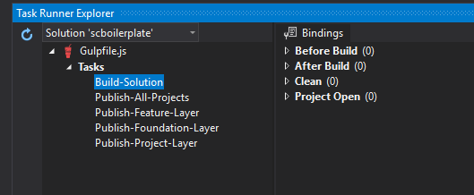
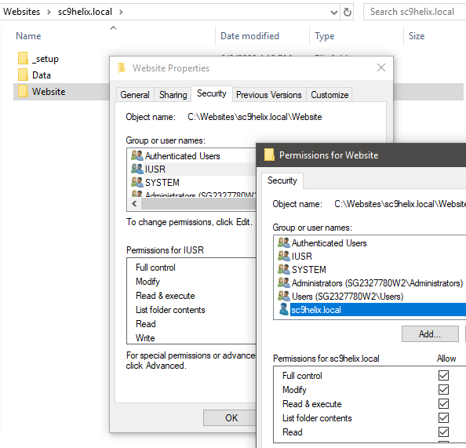

## Sitecore-Helix boilerplate  

#### Introcution

Boilerplace implemented targetting Sitecore 9.0.2 rev. 180604, upgradable to any version above via Nuget package manager.

#### Prerequisites

* Node.js
* IIS Express
  * Should have website folder pointing to IIS virtual directory, with Sitecore 'Website' folder content
* SQL Server Express 
  * Should have Sitecore databases (atleast core, master, web) deployed with users to access the database

#### Setup

Clone or download the repository. Once source code is available locally run following command from root directory of source to install dependencies.

```
npm install -g

npm install gulp
```

Once packages are installed open the task runner and refresh to see task configured for building solution and publishing each layer or full solution.



#### Troubleshooting - Tips

* Check for correct persmission for applicaiton pool user, to website root folder



#### Sitecore version upgrade