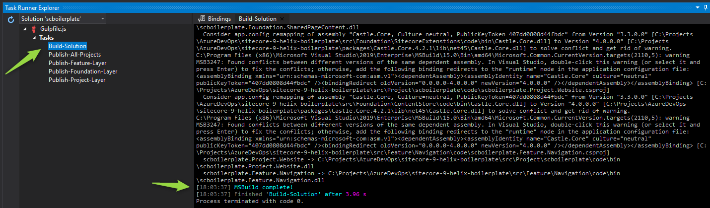
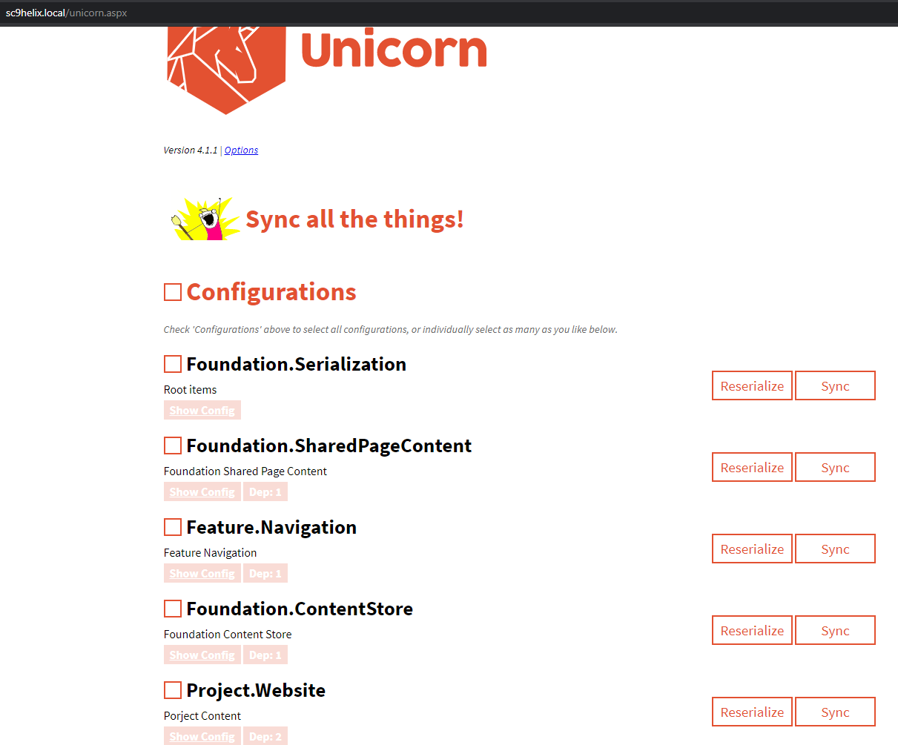
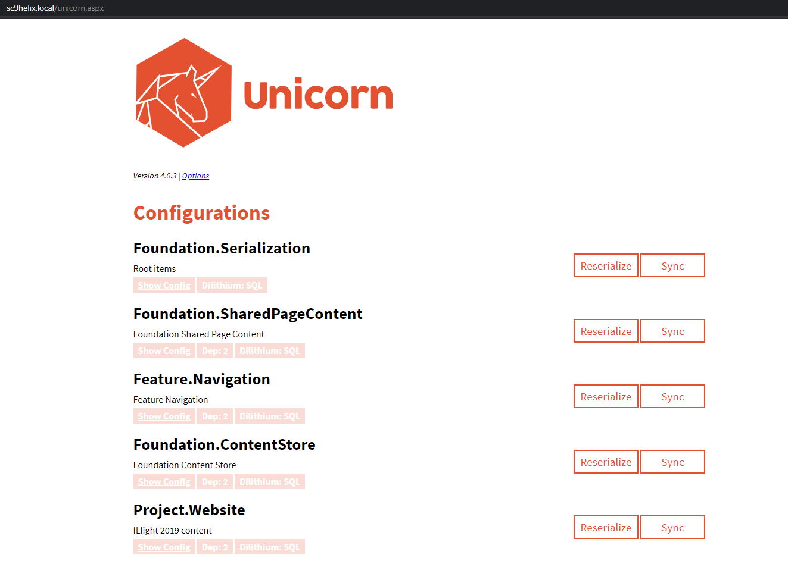

## Sitecore-Helix boilerplate  

### Introcution

Boilerplace implemented targetting Sitecore 9.0.2 rev. 180604, upgradable to any version above via Nuget package manager.

### Prerequisites

##### IIS Express
  * Should have website folder pointing to IIS virtual directory, with Sitecore 'Website' folder content
  * This sample code assumens website folder to at 'C:\Websites\sc9helix.local\Website'. 
  * And source code to be at 'C:\Projects\sitecore-9-helix-boilerplate'
    Feel free to have the setup on a diffrent location and change 'devRoot' and 'webRoot' settings updated on ht e the following configuration file.
    * gulp-config.js

##### SQL Server Express 
  * Should have Sitecore databases (atleast core, master, web) deployed with users to access the database

##### Node.js

### Setup

Clone or download the repository. Once source code is available locally run following command from root directory of source to install dependencies.

##### Installing Node Packges
```
npm install

npm install gulp
```

Once packages are installed open the task runner and refresh to see task configured for building solution and publishing each layer or full solution.


##### Nuget Restore

From task runner right click on 'Build-Solution' task. This will restore the Nugets on the initial run and build the solution.




###### Unicorn Setup

http://sc9helix.local/unicorn.aspx




### Troubleshooting - Tips

* Application pool user has read/ write permission set to website root folder

* Database user has sufficient rights granted to core, master and web databases

* Disable Xdb in Sitecore.Xdb.config  file, can be found in Marketing.xDB  folder

```
<setting name="Xdb.Enabled" value="false" />
```

* Check for correct persmission for applicaiton pool user, to website root folder


#### Sitecore version upgrade